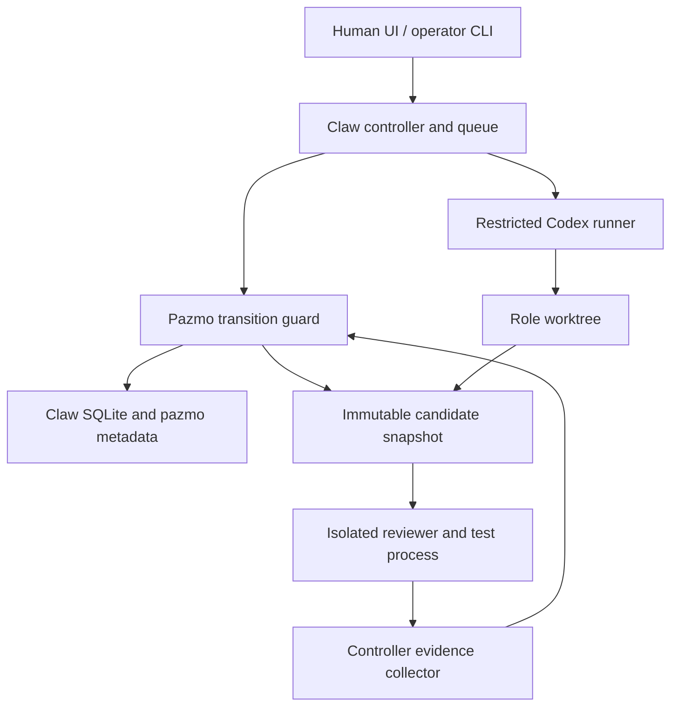
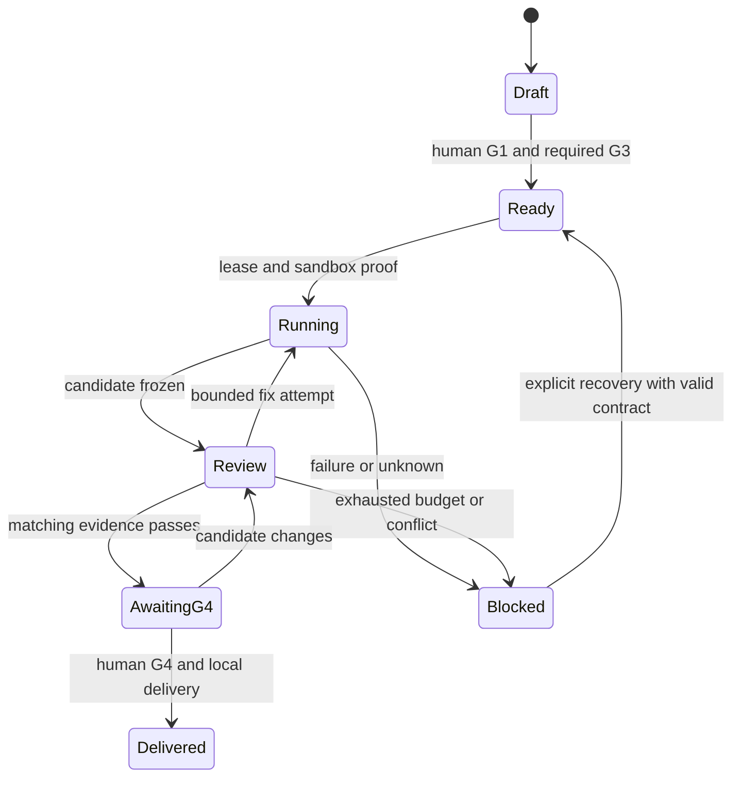
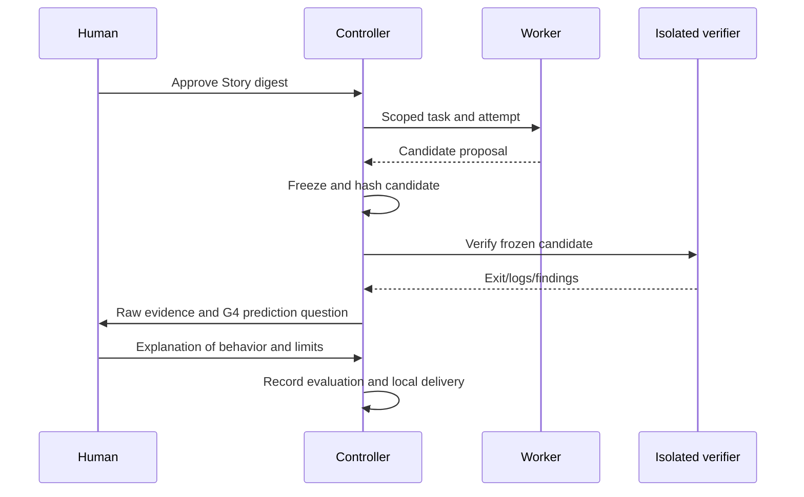

# Pazmo Agent Office - Plan

## Goal Capsule
- Objective: 사용자가 Jira 없이 AI 팀에 일을 맡기고, 검증된 결과와 미해결 문제를 구분하여 로컬로 인도받는다.
- Means: 고정 Claw Office에 계약·권한·검증 guard와 Codex runner를 연결한다 (KTD1–KTD5).
- Authority: 사용자 요청 → canonical Story M1–M6/V1–V6 → 이 계획의 HOW. Product Contract unchanged.
- Execution: 기본 인도는 로컬 변경본이다. 외부 게시·merge·npm publish는 이 계획의 실행 완료가 아니다.
- Gate: G1은 승인됨. U1은 실행 없는 원본·문서 반입이다. U2–U8의 runtime/권한/상태 변경은 G3 승인 후 실행한다. 실제 격리 미입증 시 live 자율 실행은 차단한다.
- Completion owner: 현재 workflow가 단순화·리뷰·재검증·G4·Compound까지 관리한다. 작업자는 인도를 승인하지 않는다.

---
## Product Contract
### Summary
승인된 Story의 범위를 Claw 기반 독립 배포판으로 구현한다. 요구사항 본문은 원본 Story에만 유지한다.
### Problem Frame
대상 저장소의 tracked baseline에는 LICENSE만 있다. 원본 Claw의 완료 처리와 실행 권한은 승인된 Story의 안전 규칙을 그대로 충족하지 않는다.
### Requirements
- 원본·출처: Story M1 / V1.
- 계약·승인: Story M2 / V2.
- 역할·실행: Story M3 / V3.
- 실패·권한 경계: Story M4 / V4.
- 업무 흐름·이해 확인: Story M5 / V5.
- 배포·설치: Story M6 / V6; SHOULD S1.
범위 제외·가정·제품 선택은 Story OUT 및 Decisions를 참조한다. 별도의 R 요구사항 사본은 만들지 않는다.

---
## Planning Contract
### Sources and observed constraints
모든 Claw 경로는 반입 후 `vendor/claw-empire/` 기준이다. 조사한 원본은 Story M1의 exact commit/tree다.
- `server/modules/workflow/core/cli-tools.ts`의 Codex 도구 실행은 `--enable multi_agent`와 `--yolo`를 추가한다. 단순 prompt 제한으로 M3/M4를 충족할 수 없다.
- `server/modules/workflow/orchestration/review-finalize-tools.ts`는 merge 실패를 알린 뒤 `tasks.status='done'`을 기록한다. delegated subtask에는 exit 0만으로 done을 전파하는 경로도 있다.
- `server/modules/workflow/orchestration/execution-start-task.ts`는 worktree 생성 실패 시 이미 실행을 중단한다. 기존 보호를 유지하며 회귀 시험한다.
- `server/security/auth.ts`의 `/api/auth/session`은 loopback 요청에 session cookie와 CSRF 값을 발급한다. 로컬 주소만으로 사람과 worker를 구분할 수 없다.
- `server/db/runtime.ts`는 `node:sqlite`를 사용한다. 기본 셸 Node 22.3.0은 제품 지원 근거가 아니다. 로컬에 있는 Node 24.19.0을 baseline 후보로 사용하고 실제 시험 후 지원 버전을 고정한다.
- `package.json`의 pnpm은 10.30.1이다. `dev`는 LAN에 바인딩하며 prestart는 Remotion runtime 준비를 호출한다. 초기 조사는 설치/시작 스크립트를 실행하지 않았다.
- `server/modules/routes/core/update-auto/register.ts`의 자동 업데이트는 기본 비활성이나 켤 수 있다. Pazmo 빌드에서는 mutation 경로 자체를 차단한다.
- `server/config/runtime.ts`는 소스 위치 기준 package/dist/.env와 runtime data 경로를 계산한다. nested vendor와 npm 배포를 별도로 검증해야 한다.
- 설치된 Codex CLI 0.154.0의 help에서 exec JSONL, user-config/rules 무시, sandbox 정책, sandbox 직접 시험 기능을 확인했다. 명령 존재는 격리 성공의 증거가 아니다.
- 공식 [agent approvals/security](https://developers.openai.com/codex/agent-approvals-security), [noninteractive](https://developers.openai.com/codex/noninteractive), [authentication](https://developers.openai.com/codex/auth)을 runner 근거로 사용한다. 실제 플래그는 설치 CLI와 대조한다.

### Key Technical Decisions
- KTD1. Claw의 단일 큐·SQLite를 유지하고 `pazmo_` 보조 테이블로 계약 참조·승인·attempt·evidence·lease·예산을 저장한다 (M2–M4). Story 본문은 DB에 편집 가능한 복제본으로 저장하지 않는다. 별도 scheduler/DB는 일관성 경로를 늘리므로 도입하지 않는다. 기존 status enum에는 의미를 매핑하고 상세 blocker는 보조 상태로 노출한다.
- KTD2. Office controller만 승인과 전이를 쓴다 (M2/M4). 최초 로컬 pairing은 worker에게 보이지 않는 operator 경로로 하며 기존 loopback 자동 session 발급을 사람이란 증거로 쓰지 않는다. worker·verifier에는 승인 DB, 정책, operator token, 제어 API, 브라우저 세션 접근을 주지 않는다. G1은 Story digest, G3는 중요 결정 digest, G4와 인도는 candidate 및 검증 계약 digest에 결합한다.
- KTD3. 작업 트리 스냅샷의 내용·mode·symlink·허용 untracked 파일을 manifest로 고정한다 (M4). symlink 외부 이탈을 거부한다. controller가 digest를 계산하고 reviewer와 verifier는 동일한 고정 후보를 읽는다. 고정 원본은 worker와 inode를 공유하지 않고 쓰기를 금지한다. 테스트 산출물은 별도 scratch에 쓰며 검증 전후와 인도 직전 digest를 대조한다. 테스트도 untrusted 실행이므로 verifier 명령은 별도 sandbox에서 실행하고 controller는 결과를 직접 수집한다. worker의 JSON 성공 보고나 수정된 테스트 기준은 증거가 아니다.
- KTD4. 모든 완료·merge·resume·recovery·child·callback 진입점은 동일 guard를 호출한다 (M4). DB transaction의 attempt/version 비교로 전이·예산·lease를 갱신한다. 프로세스 생존이 불명확한 재시작은 HUMAN_REQUIRED로 남긴다. 모델 종료, 시험 성공, 리뷰 성공, G4, 로컬 인도는 별도 사실이다. 자동 원격 push/PR과 upstream merge-to-dev를 기본 실행에서 제거한다.
- KTD5. Codex-only runner를 도구/환경 allowlist 및 OS가 강제하는 제한과 함께 사용한다 (M3/M4). 먼저 현재 macOS의 제한 읽기·쓰기 permission profile과 네트워크 차단을 실제 canary로 검증한다. 기본 workspace-write 또는 chmod만을 보안 경계로 인정하지 않는다. 도구가 controller 파일/프로세스/소켓, 다른 repo, 홈·인증자료, 브라우저나 새 Codex child로 탈출하면 live 실행을 잠근다. native 정책으로 부족하면 별도 OS identity/container 설계를 새 G3로 제시한다. 현재 Docker/Podman은 PATH에서 발견되지 않았다.
- KTD6. 일반 worker의 중첩 subagent는 기본 비활성이다 (M3). 전체 모델 실행 슬롯을 controller가 계수할 수 있는 경로만 허용한다. CE 제한 실행/보고 반환과 필요한 Superpowers 규율을 역할별 프로필로 묶고 source/ref/hash/license/reference를 잠근다. 설치 스킬의 필수 오케스트레이션을 지원하지 못하면 실행했다고 주장하지 않고 명시적인 Pazmo 파생 프로필이나 BLOCKED를 사용한다.
- KTD7. root TypeScript package와 Claw runtime build를 분리한다 (M6). npm은 root CLI, 빌드된 runtime/UI, schema·동적 runtime script·sprite·template·license의 allowlist만 포함한다. vendor의 node_modules와 원본 전체, .git, DB/log/auth/.env/사람 답변은 제외한다. lifecycle에서 clone/build/전역 설정 변경을 숨기지 않는다. Remotion/PPT는 검토·검증 전 비활성이다.
- KTD8. 초기 runtime은 신규·격리된 Office data directory만 사용한다 (M1/M6). 실제 사용자 기존 DB를 자동 migration하지 않는다. Pazmo 테이블은 additive migration과 사전 백업을 사용한다. migration 실패 시 시작을 중단하고 이전 runtime+백업으로 복구한다. remove는 관리 manifest와 hash가 일치하는 파일만 대상으로 하며 사용자 산출물은 보존한다.

### High-Level Technical Design

상태도는 Pazmo 도메인 상태다. upstream DB status 문자열을 그대로 추가하라는 뜻이 아니다 (KTD1).

### Alternatives and G3 decision
권고는 KTD2–KTD5의 controller/worker/verifier 권한 분리다. 같은 계정·전체 환경을 넘기고 prompt로 제한하는 방식은 loopback session 발급과 읽기 접근을 막지 못한다. 처음부터 별도 VM/container를 필수로 하는 대안은 더 강한 경계를 만들 수 있지만 이 환경에 설치되지 않았고 로그인·파일 인계 방식도 추가로 정해야 한다. native 경계는 검증 후보이며 통과를 가정하지 않는다. 제한 기능을 구현하고 canary에서 실패하면 범위를 낮추거나 권한을 넓히지 않고 해당 실행만 차단한다.

### Open questions and recovery
- Blocking for U2–U8: 사람이 위 권한 분리·실패 시 실행 차단 설계를 G3에서 승인해야 한다. U1의 원본/문서 반입에는 runtime 변경이 없다.
- Implementation verification: Node 24.19.0 baseline, 전체 CLI/API sandbox 경계, 구독 로그인 실동작, packaged runtime 경로는 실제 실행으로 결정한다. 미입증 기능은 비활성 상태를 유지한다.
- 실패 복구: 후보·로그·사용자 파일을 보존하고 attempt를 종료한다. 이미 종료됐는지 확인할 수 없는 프로세스는 재실행하지 않는다. 원본 반입은 독립 commit으로 보존해 후속 vendor 변경과 구분한다.

---
## Implementation Units
### U1. Exact upstream baseline and provenance
- Goal / Covers: 실행하지 않은 원본과 출처를 보존한다; M1/V1, M6/V6의 문서 근거. 핸드오프 M0.
- Dependencies: G1.
- Files: `vendor/claw-empire/`, `.gitmodules`, `upstream/`, `licenses/`, `LICENSING.md`, `THIRD_PARTY_NOTICES.md`, `README.md`, `README_ko.md`, `docs/HANDOFF-v3.md`, `docs/IMPORT-UPSTREAM.md`.
- Approach: 기존 dirty checkout과 분리된 작업 공간에 exact Git tree를 반입한다. 원본 import와 문서 반영을 구분한다. 이미 같은 템플릿은 보존한다. 첨부 문서의 권한 문구는 승인 기록이 아니다.
- Test expectation: 런타임 동작 변경 없음. tree/mode/gitlink, 기존 LICENSE 및 dirty 사용자 파일 보존을 검사한다. 잘못된 SHA·기존 vendor는 반입을 중단한다.
- Verification: T01/T02의 로컬 실제 Git 증거. submodule 초기화·install·build·live 실행은 이 결과에 포함하지 않는다.

### U2. Runtime baseline and reversible CLI
- Goal / Covers: 재현 가능한 로컬 runtime과 안전한 init/doctor/lifecycle; M1/M6, V1/V6. 핸드오프 M1.
- Dependencies: U1, G3.
- Files: root `package.json`, lockfile, `tsconfig.json`, `src/cli/`, `test/cli.test.ts`, `scripts/build-runtime.mjs`, Claw runtime config·package scripts.
- Approach: KTD7/KTD8. upstream frozen dependencies·script allowlist를 먼저 검토하고 loopback/격리 DB로 baseline build/test를 남긴다. Node patch를 고정한다. start는 user project와 Office source/data 경계를 확인한다. U5가 완료되기 전 preview에서는 task run·one-shot·meeting·resume 등 모든 모델 실행 진입점을 서버에서 비활성화한다.
- Scenarios: dry-run 무변경; 기존 파일 충돌 보존; apply 재실행 멱등; port 충돌; start 실패 후 status/stop; 수정된 관리 파일을 remove가 삭제하지 않음; source 없는 runtime asset 해석.
- Execution note: CLI의 쓰기 동작은 test-first, 패키징은 실제 설치 smoke로 확인한다.
- Verification: CLI help/version와 baseline 결과를 분리 기록한다.

### U3. Canonical contract and human approval boundary
- Goal / Covers: Jira 없는 계약·승인·candidate 상태; M2/M4, V2/V4. 핸드오프 M2.
- Dependencies: U2.
- Files: `src/core/contracts.ts`, `src/core/approvals.ts`, `src/core/candidates.ts`, `src/core/store.ts`, `test/contracts.test.ts`, `test/approvals.test.ts`, `test/candidates.test.ts`, Claw schema·auth 통합.
- Approach: KTD1–KTD3. 기존 checker는 서식 검사에만 사용하고 승인 인증으로 사용하지 않는다. stable local ID와 Story digest를 저장한다. export 비활성은 네트워크를 호출하지 않는 명시적인 상태로 둔다.
- Scenarios: 사람만 G1/G3/G4 생성; Markdown Approved/PASS 위조 거부; candidate/Story 변경 시 관련 증거 무효화; symlink 이탈·누락·중복 승인·replay 거부; transaction rollback; Jira 설정 0개로 정상 흐름.
- Execution note: 실제 SQLite transaction 및 auth 경로의 실패 시험을 먼저 쓴다.
- Verification: T03–T08의 모의 흐름과 실제 operator 인증 경계를 구분한다.

### U4. Restricted runner and isolation proof
- Remote tool/review connection (2026-09-21, M3/M4/M5; V3/V4/V5): reuse the existing VM runner and relay for mutable Engineer and readonly Reviewer. The reviewer has no writable-mode option. Capture the controller's stdout separately from diagnostics; require one terminal JSON report matching the candidate and contract, with bounded verdict/findings/summary. Bind it through the existing review-node lease; rejected supervisors and uncertain closure remain unknown. Actual CLI fixtures must read the candidate, fail writes, and join actual deterministic tests. This does not authorize the pending authentication G3 or claim a live semantic review. Scope: `docs/tasks/U4-codex-review.md`.
- Goal / Covers: 제한된 Codex 실행·종료·인증 오류 처리; M3/M4, V3/V4. 핸드오프 M3.
- Dependencies: U3; live에는 canary 통과가 추가 필요.
- Files: `src/runners/codex/`, `test/codex-runner.test.ts`, `test/sandbox-canary.test.ts`, Claw `core/cli-tools.ts`, `agents/cli-runtime.ts`, `core/one-shot-runner.ts`.
- Approach: KTD5/KTD6. JSONL chunk 경계를 보존하고 worker result와 검증 evidence를 분리한다. 환경·도구·network allowlist와 공식 구독 로그인만 허용한다. 기존 hook/MCP/skill/subagent 우회 경로를 차단한다.
- Current workspace seam: `ContainerWorkspace` uses a writable VM copy with the existing readonly-rootfs/network/UID restrictions. A fresh readonly exporter reads only after the writer is removed. The host validates a bounded JSON/base64 representation and swaps private staging; it never unpacks a worker-created archive into the project. `ContainerVerifier` retains a separate readonly interface. Actual VM outcomes are in `docs/verification/2026-09-21-mutable-workspace.md`; actual Codex remote tools and readonly review now connect through the companion `docs/verification/2026-09-21-codex-workspace-review.md` evidence; authenticated models remain pending.
- Scenarios: malformed/split JSONL; nonzero/timeout/cancel; 자식 프로세스 종료; auth/limit/model 오류; 다른 provider 자동 대체 없음; 홈·다른 repo·승인 DB·정책·token·프로세스·브라우저·소켓 canary; 금지된 신규 child 실행.
- Verification: T13/T14는 실제 OS 차단 로그로 입증한다. fixture 성공은 live 성공이 아니다. canary에서 금지 자원 하나라도 접근되면 실행을 비활성화한다.

### U5. Guard every state and completion path
- Goal / Covers: 충돌·실패·재시작에서 거짓 완료를 방지한다; M4/V4. 핸드오프 M3/M5.
- Dependencies: U3/U4.
- Files: `src/adapters/claw/`, `test/claw-transitions.test.ts`, Claw `orchestration/review-finalize-tools.ts`, `meetings/review-consensus-outcome.ts`, `orchestration/execution-start-task.ts`, `core/worktree/merge.ts`, task CRUD/execution-control/subtasks, recovery·decision-inbox·update-auto 경로.
- Approach: KTD1/KTD4. 모든 native 상태 쓰기와 process launch의 목록을 만들고 각각 guard의 실제 호출 경로에 연결한다. runtime 불완전 시 native UI/API의 실행도 잠근다.
- Scenarios: exit 0+test fail/unknown; reviewer 실패; conflict 후 done 금지; child 완료로 parent 우회 금지; 수동 PATCH/resume/startup/meeting 우회 거부; 취소 후 callback·다른 attempt·중복 결과 무시; updater로 guard 대체 불가.
- Execution note: 기존 실패 경로 characterization과 실제 route+DB 통합 시험을 먼저 만든다.
- Verification: T06–T11을 실제 Claw API/DB까지 확인한다. 단순 코드 검색은 경로 목록 작성 도구이며 통과 증거가 아니다.

### U6. Role handoff and persistent budgets
- Native planning continuation (2026-09-23): new intake packets opt into kit PM clarify/propose and Lead investigate/plan. Reuse `KitRoleRun` with immutable request/approved Story sources and real Office G1 evidence; the CLI owns readiness, question tokens and local attempts. Office consumes role completion, records addressed questions and human scope decisions, and shares the existing planning leases/budget. Record native evidence before the synchronous SQLite acceptance/release transaction; interrupted cross-store writes stop for inspection without replay. Preserve legacy packets. Add the G1 scope form and actual service routing for result evidence. Scope: `docs/tasks/U6-kit-planning.md`; public model launch and contract approval/publication remain subsequent connections.
- 2026-09-23 actual-pilot finding: a model Reviewer may pass ambiguous wording that integration review later rejects. Add a controller-only, candidate/contract-bound feedback event before delivery; preserve original observations, invalidate pending G4 eligibility, and route through the existing global fix budget and kit feedback command. Deliver the finding in the next role packet; do not alter the old Reviewer verdict or manufacture a failed test. Validate stale/duplicate feedback, exhausted retries and fresh G4 evidence after correction.
- 2026-09-23 role-run integration (Story D7, M2–M4/V2–V4): use the installed, integrity-checked npm kit 4.1.0 CLI as the only role-node writer. Persist runs under controller-owned `.pazmo-office/role-runs/`, excluded from VM candidates. Office leases remain process/budget authority; never copy node status into independently writable DB state. Bind immutable assignments to task, canonical source, M/V scope and candidate manifest digest. Reopen existing runs; uncertain process closure remains blocked rather than resetting or starting a new run. Store immutable command inputs/evidence before each CLI call; stale tokens and evidence are rejected by kit. A process/file/DB boundary is not a distributed transaction: uncertain completion must reconcile the same run/lease and never replay the model automatically.
- First integration slice: a bounded controller adapter and installed-command tests for role dispatch, question/answer token rotation, external feedback, cancelled/late result rejection, changed source and produced/reviewed snapshot binding. No replacement graph engine or kit source edits. Preserve legacy in-flight coordinator behavior; enable the new path explicitly for fresh assignments only.
- Next consumer: bind Developer implement/self-check and separate Reviewer to existing frozen candidates and VM runners. Keep project verification/G4 guards but derive role readiness and retry routing from CLI results. Connect PM request graph before approval, and team-lead graph only after real G1; the existing pre-G1 Lead proposal is not that stage. Skill discovery stays disabled until trusted stage references are explicitly supplied and qualified; record direct fallback rather than claiming installed plugins ran.
- Plan review: sequential inline review under project tool mapping. Principal risks are conflicting authorities, crash between lease and run writes, question-token reuse, and treating needs_changes as approval. Verify each at the adapter boundary, then integration and authenticated pilot. Confidence is high for CLI transport, medium for recovery/UI consumers pending implementation evidence. This resumes the existing CE plan in caller-owned context; no new product approval or separate engine is introduced.
- Coordinator connection (2026-09-21, M3/M4/M5): internal controller orchestrates existing ledgers/runners without another queue. Build bounded role packets from digest-checked approved documents, candidate identity and previous round findings; Reviewer also receives the replay-checked original-to-candidate diff. Start independent review and tests within shared capacity, await all owned supervisors, and route through the persisted round. Re-enter Engineer only for `fix_required`, at most two fixes. Reserve actual configured role timeouts instead of unconditional ten-minute budgets. Stop on G4/unknown/cancel/exhaustion; return deferred when external capacity remains unavailable. No public/live unlock or automatic unknown recovery. Scope: `docs/tasks/U6-role-coordinator.md`.
- Goal / Covers: 역할별 담당자에게 동일 후보의 일과 재작업을 전달한다; M3/M5, V3/V5. 핸드오프 M4.
- Dependencies: U4/U5.
- Files: `assets/roles/`, `upstream/skills.lock.json`, `src/core/handoffs.ts`, `src/core/budgets.ts`, `test/handoffs.test.ts`, `test/budgets.test.ts`, Claw queue integration.
- Approach: KTD1/KTD6. task/attempt/role/dependency/candidate를 packet/result에 명시한다. review 중복 key는 task+candidate+purpose+policy다. 슬롯·총 시간·자동 fix 횟수를 재시작에도 보존한다.
- Current implementation seam: `src/runners/dispatch.ts` drains registered tests through the existing execution/verification ledgers. It returns deferred nodes when other work owns capacity, aborts and awaits local supervisors when the round closes, and keeps the reviewer mandatory. The internal OfficeCoordinator now connects approved role packets, Engineer, parallel tests/review and bounded fixes; authenticated role dispatch and a capacity-wakeup service remain pending. `HandoffLedger` now captures the approved workspace selection before reserving a supervisor handle, persists baseline/attempt/candidate ancestry, and admits verification only after successful closure. Fixes use the previous candidate while retaining the original baseline. Schema v6 backs up owned v1–v5 before adding handoffs; `runEngineerJob` now connects the handoff to bounded mutable VM commands, stopped-writer export and validated replacement of controller staging. Actual Codex CLI supervision and readonly Reviewer receipts are connected with scripted responses. Authenticated roles and public Office execution remain pending; scripted judgments do not establish semantic review. See `docs/verification/2026-09-21-role-coordinator.md` for the internal automatic flow.
- Scenarios: 최대 실행 3/구현 2 경계의 경쟁; retry 2회 소진; 잘못된 담당자/후보 결과 거부; restart 예산 보존; 공유 파일/DB/port 직렬화; 선택 스킬 누락·변경·숨은 도구 실패; CE 반환 모드의 외부 shipping 금지.
- Verification: T12/T15/T16; 실제 3역할 증거가 없으면 live 협업 미검증으로 남긴다.

### U7. Office UI and three workflow pilots
- Supported launch continuation: `start --live --controller PATH --executor PATH` passes trusted startup configuration from the CLI (existing Mac Codex home and dedicated VM socket) into the owned service; browsers cannot select binaries or authentication paths. Preflight pinned binaries, login-file presence, Git project and dedicated VM/image; retain per-run container checks. Keep preview start locked. Store the first planning snapshot outside the project and reuse it across answers/G1. Authenticated, addressed run/cancel routes call existing coordinators asynchronously, deduplicate before launch, and surface leases/results through existing ledgers. Reject normal stop while workers are active; cancellation awaits cleanup and SIGTERM drains before closing SQLite. Show readiness and run/cancel/publication controls without inventing approvals. Tests cover actual service routing, controller admission/cancellation, stale submissions and UI requests. Reuse existing G3 topology; no new model route or isolation policy. Scope: `docs/tasks/U7-live-launch.md`.
- Result action continuation (2026-09-23): expose the existing validated completion bundle through authenticated GET `/api/pazmo/evidence/:taskId`; reuse `CompletionLedger` eligibility, never accept a caller's diff. The operator displays diff encoding and mode metadata, resumes the current G4 request, submits exact human text using existing approval endpoints, and delivers only server-approved results using the existing delivery endpoint. Keep evaluation controller-only, guard subject changes between inspect/request, retain disconnected drafts separately and do not retry uncertain writes. This connects result controls; evaluator automation and public model launch remain separate work. Scope: `docs/tasks/U7-result-actions.md`.
- Execution visibility continuation: extend the existing operator shell with manual contract listing and latest verification/role-process/G4/delivery reads through its current private endpoints. Reuse in-memory credentials and disconnect generation guards; render model text with textContent, clear stale details before refresh and show unknown fetch outcomes explicitly. Keep graph files authoritative and add no status mutation, model launcher or approval evaluator. Verify pending/accepted/delivered distinctions, no POST from reads, XSS payloads, failed refresh and disconnect races.
- Intake screen connection (2026-09-22): keep the imported preview locked and link it to an Office-owned `/operator` shell using the existing operator bearer boundary. Fixed trusted assets, no token-bearing HTML/URL/browser storage, existing Origin checks, text-only conversation rendering and server revision/digest checks. Add a project-scoped 50-item cursor list; no new queue, approval logic or model launcher. Existing-project create/read/answer/cancel comes first; project switching, publication/approval/delivery UI and live pilots remain. Scope: `docs/tasks/U7-intake-console.md`; evidence: `docs/verification/2026-09-22-intake-console.md`.
- Goal / Covers: 사용자가 계약·실행·검토·대기 이유를 보고 결정한다; M2/M5 및 S1, V2/V5. 핸드오프 M5.
- Dependencies: U5/U6.
- Files: Claw `src/components/` 관련 task/decision 화면, `src/api/`, `test/e2e/office-workflow.spec.ts`, `docs/pilots/`.
- Approach: 기존 UI를 확장하여 Story 링크·후보·승인 대기·blocker·evidence를 연결한다. G4는 raw diff/evidence를 먼저 제시하고 인간 응답 후 평가한다. API에서도 동일 human-only 경계를 적용한다.
- Current implementation seam: `src/core/completion.ts` persists immutable evidence, addressed human answers and separately assessed understanding. Operator HTTP/CLI cannot supply its own assessment. `CompletionLedger.prepare` now captures an actual Git diff from the controller baseline and the round's frozen candidate, replays it in a private copy, and binds both digests and POSIX mode metadata to G4. Bounded commands use a private cwd/environment and never execute candidate code. Empty snapshots cover greenfield and deletion-only changes. The preparer now selects the original baseline through the successful persisted Engineer handoff; a caller cannot select a different baseline. Actual Engineer supervision and the semantic evaluator remain pending; fixture assessments are not evidence of actual understanding. Schema v6 includes the attempt ancestry.
- Scenarios: 최초 빈 화면; loading/실패/재시작; 키보드 승인 흐름; G4 답변 전 해설 숨김; 변경 후보 승인 무효화; brownfield/greenfield/analysis pilot; 분석 결과의 출처·합계·표본 검증. task 상세의 우선순위는 상태/차단 이유→Story/후보→검증 근거→사람의 결정이며, 승인 요청 실패 시 입력과 후보 식별자를 보존한다.
- Verification: loopback 브라우저+DB+로그 대조 및 실제 화면 캡처. 모의 pilot과 live pilot을 분리한다.

### U8. Tarball and delivery evidence
- Goal / Covers: 소스 없이 설치·제거할 수 있는 검증된 배포 후보; M6/V6 및 M5/V5. 핸드오프 M6.
- Dependencies: U2–U7.
- Files: root package allowlist, build script, `test/package-install.test.ts`, `.github/workflows/ci.yml`, `README.md`, `README_ko.md`, `LICENSING.md`, `THIRD_PARTY_NOTICES.md`, `docs/verification/`, `docs/solutions/`.
- Approach: KTD7/KTD8. 실제 tarball을 임시 새 폴더에 설치하고 UI/CLI를 실행한다. macOS local과 Linux CI의 증거 경계를 표시한다. CI에는 구독 인증자료를 넣지 않는다.
- Scenarios: archive 누락 asset/script/schema; .env/auth/DB/log 포함 차단; install lifecycle 무승인 변경 없음; 수정 파일 보존 remove; secret-free 패키지와 혼합 license 대조.
- Verification: T17/T18, 최종 관련 테스트·단순화·리뷰·재검증·G4 및 Compound. 목표 alpha 버전은 검증된 metadata와 파일 목록을 제시하되 publish하지 않는다.

---
## Verification Contract
| Story | Units | Evidence |
|---|---|---|
| M1/V1 | U1/U2 | exact tree/mode/gitlink·LICENSE·dirty 보존, frozen baseline |
| M2/V2 | U3/U7 | Jira 없는 API/UI 흐름, 서식·로컬 ID·승인 경계 |
| M3/V3 | U4/U6 | mock 실패 주입, 실제 구독 3역할, persisted budget |
| M4/V4 | U3–U6 | 위조·stale candidate·timeout/recovery·모든 native 완료 경로·OS canary |
| M5/V5 | U6–U8 | 3종 pilot, 리뷰·재검증·G4 원문과 평가·학습 |
| M6/V6 | U2/U8 | 실제 pack/install/start/remove, license·파일 목록·UI smoke |

기존 upstream 명령은 `pnpm run build`, `pnpm run test:web --run`, `pnpm run test:api --run`, `pnpm run openapi:check`, `pnpm run test:e2e`다. U2에서 frozen baseline 및 안전한 실행 환경을 확보한 뒤 사용한다. 새 root test/verify/package 명령은 U2/U8에서 정의하고 실제 결과에 경로·명령·exit·candidate digest를 기록한다. 제품 동작 변경은 behavioral RED→GREEN을 관찰한다.

Story 상태 검사는 `.ai-workflow/bin/check.mjs story`와 해당 `gate G1|G4`를 각각 실행한다. 서식 검사가 실제 human identity나 실행 증거를 인증하지 않는다는 경계를 유지한다.

---
## Definition of Done
- 각 U-ID는 자기 Verify 결과를 갖고 Story M/V 및 핸드오프 T01–T18의 적용 범위를 연결한다.
- 필수 live/격리/패키지 시험이 미실행이면 제품 전체를 완료나 공개 배포 준비 완료로 선언하지 않는다.
- 단순화 후 최종 diff를 리뷰하고 수정된 동작을 재검증한다. G4의 사람 응답·평가와 checker exit 0이 있어야 Delivered로 변경한다.
- 실험·폐기 코드와 불필요한 배포 파일을 정리하고 사용자 파일·작업 후보·실패 증거를 보존한다.
- 재사용할 교훈은 Compound로 기록하고 없는 경우 이유를 남긴다. 원격 PR/merge/npm publish는 별도 권한 없이 실행하지 않는다.
